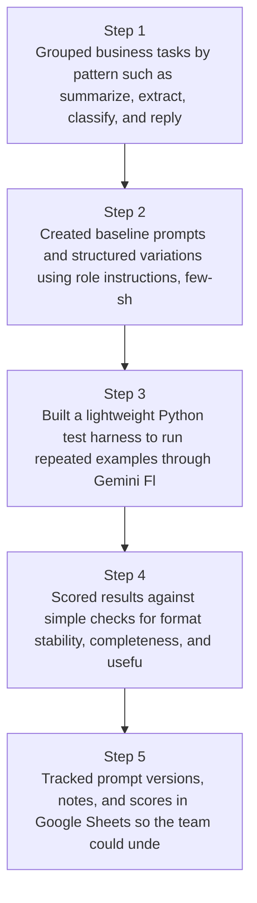
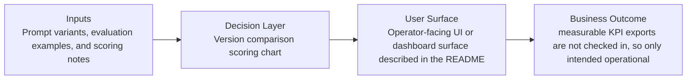
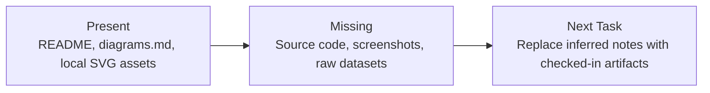

# Prompt Reliability Workflow Diagrams

Generated on 2026-04-26T04:29:37Z from README narrative plus project blueprint requirements.

## Prompt evaluation workflow

## Version comparison scoring chart

## Evidence Gap Map

